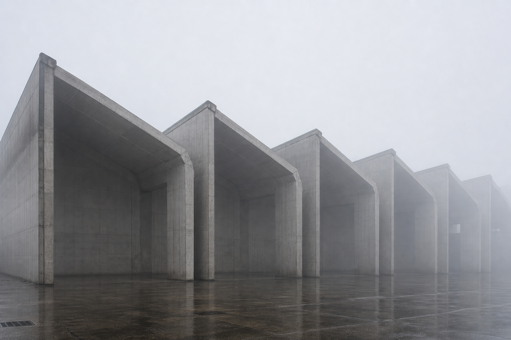

# Panacea Identity System / Panacea 品牌识别系统

<p align="center">
  
</p>

Panacea is a long-term identity system for `panacea`, `人間良藥`, `allheilmittel`, and the icon `a`. It connects an original architectural typeface, a 26-part photographic alphabet, vehicle identity studies, production assets, and interactive design tools.

Panacea 是围绕 `panacea`、`人間良藥`、`allheilmittel` 与图标 `a` 建立的长期品牌识别系统。项目将原创建筑字体、26 组建筑摄影字母、车辆识别研究、生产资产与交互设计工具整合为同一套语言。

This is not a logo exploration folder. It is a maintainable system for vehicles, packaging, signage, products, software, editorial material, objects, and architecture.

这不是一个 Logo 探索文件夹，而是一套面向车辆、包装、招牌、产品、软件、编辑出版物、物件与建筑应用的可维护系统。

## Explore / 项目入口

| Entry / 入口 | Purpose / 内容 |
| --- | --- |
| [`index.html`](index.html) | Project landing page / 项目入口页 |
| [`panacea.html`](panacea.html) | Interactive Architectural Alphabet lattice with click-to-open specimens and font export tools / 可交互建筑字母格栅、点击展开样本与字体导出工具 |
| [`3d-preview.html`](3d-preview.html) | Tesla Model 3 PNG decal placement study / Tesla Model 3 PNG 贴纸三维位置研究 |
| [`assets/architectural-alphabet/`](assets/architectural-alphabet/) | 26 architectural archetype photographs and mapping / 26 张建筑原型摄影及对应关系 |
| [`assets/font/PanaceaArchitectural-Regular.ttf`](assets/font/PanaceaArchitectural-Regular.ttf) | Installable Panacea Architectural Regular font / 可安装字体 |

Live website / 在线网站：

<https://zilazer.github.io/panacea-identity-system/>

Direct pages / 页面直达：

- Architectural Type System + Alphabet / 建筑字体系统与建筑字母志：<https://zilazer.github.io/panacea-identity-system/panacea.html>
- Model 3 3D Preview / Model 3 三维预览：<https://zilazer.github.io/panacea-identity-system/3d-preview.html>

To view the project locally:

如需本地查看，请在项目根目录启动静态服务器：

```bash
python3 -m http.server 8765
```

Then open / 然后打开：

- `http://127.0.0.1:8765/`
- `http://127.0.0.1:8765/panacea.html`
- `http://127.0.0.1:8765/3d-preview.html`

The 3D preview loads Three.js modules from `unpkg.com`, so it requires an internet connection even though the vehicle model is stored locally.

三维预览的车辆模型保存在本地，但 Three.js 模块从 `unpkg.com` 加载，因此使用时仍需联网。

## Three Active Programs / 三个当前项目

### 1. Architectural Alphabet / 建筑字母志

**PANACEA — Architectural Alphabet** maps every glyph in Panacea Architectural Regular to an architectural archetype. The website now presents the 26-part alphabet as a restrained interactive lattice: hover illuminates each unit, clicking a glyph opens the large glyph/photo specimen, and the final panacea mark opens the font tester and export tools.

**PANACEA — Architectural Alphabet** 将字体中的每个字母对应到一种建筑原型。网页现在以克制的交互格栅呈现 26 组字母：悬停时单元亮起，点击字母展开大幅字形与建筑照片样本，最后的 panacea 标记可打开字体试用与导出工具。

Series constants / 系列统一规则：

- winter, 10:00 AM / 冬季上午 10 点
- dense fog, no people / 大雾、无人
- concrete industrial architecture / 混凝土工业建筑
- wet ground and cool neutral gray / 湿地面与冷灰色调
- telephoto compression and systematic composition / 长焦压缩与类型学构图
- no logos, vehicles, signage, text, or plant subject / 无 Logo、车辆、标识、文字或植物主体



Full mapping / 完整映射：[Architectural Alphabet README](assets/architectural-alphabet/README.md)

### 2. Architectural Type System / 建筑字体系统

Panacea Architectural Regular is an original geometric typeface derived from the `panacea` wordmark. Uppercase and lowercase input share the same architectural glyph outlines.

Panacea Architectural Regular 是从 `panacea` 字标推演出的原创几何字体。大写与小写输入映射到同一组建筑构件式轮廓。

Core rules / 核心规则：

- one structural stroke weight / 统一结构线宽
- modular construction / 模块化构成
- open counters and straight components / 开放字腔与直线构件
- shared roof angle / 统一屋檐角度
- no decorative curves / 不使用装饰性曲线

Font assets / 字体资产：

- `assets/font/PanaceaArchitectural-Regular.ttf`
- `assets/font/source/panacea-alphabet-4th.svg`
- `tools/build_panacea_font.py`
- `assets/font/README.md`

The current font is Version 0.4 and covers `A-Z`, `a-z`, space, comma, period, and question mark. Numerals and other punctuation are not included yet.

当前字体为 0.4 版，包含 `A-Z`、`a-z`、空格、逗号、句号与问号，尚未包含数字和其他标点。

### 3. Tesla Model 3 Vehicle Identity / Tesla Model 3 车辆识别

The vehicle program applies the same restrained architectural language to a September 2025 mainland China Model 3 RWD in deep metallic blue. It focuses on small die-cut decals and discoverable placement rather than full-body graphics.

车辆项目把同一套克制的建筑语言应用于用户 2025 年 9 月购入的中国大陆深蓝色 Model 3 后轮驱动版。重点是小尺度模切贴纸与可被发现的位置，而不是大面积车身图案。

Vehicle direction / 车辆方向：

- minimal intervention / 最小介入
- architectural detail / 建筑化细节
- hidden branding / 隐藏式品牌
- quiet luxury / 安静的高级感
- point graphics, not full-body graphics / 点状图形，不做大面积覆盖

The current deliverables include multi-view raster blueprints, placement specifications, a production guide, a local glTF preview model, and an interactive PNG decal projection tool.

当前成果包括多视角栅格图纸、位置规范、制作指南、本地 glTF 预览模型，以及交互式 PNG 贴纸投射工具。

Important: the 3D model is for visual placement studies only. Final sticker dimensions require physical measurement on the actual vehicle.

重要：三维模型只用于视觉位置研究，最终贴纸尺寸仍需在实车上测量。

## Brand Layers / 品牌层级

| Layer / 层级 | Asset / 资产 | Role / 作用 |
| --- | --- | --- |
| Master Brand / 主品牌 | `panacea` | Primary public-facing mark / 主要对外标识 |
| Concept Layer / 理念层 | `人間良藥` | Philosophy, editions, and cultural context / 品牌哲学、版本与文化语境 |
| Archive Layer / 档案层 | `allheilmittel` | Research, documentation, and archival systems / 研究、文档与档案系统 |
| Icon Layer / 图标层 | `a` | Small surfaces, app icons, stickers, and stamps / 小尺度表面、App 图标、贴纸与印章 |

These are contextual layers of one identity, not competing logos.

它们是同一套识别系统在不同语境下的层级，而不是互相竞争的 Logo。

## Repository Structure / 仓库结构

```text
index.html                         Project entry / 项目入口
panacea.html                       Interactive Architectural Alphabet lattice + font tools
3d-preview.html                    Model 3 decal preview / 三维贴纸预览
assets/
  architectural-alphabet/
    photos/                        26 architectural photographs / 26 张建筑摄影
  font/                            TTF and vector source / 字体与矢量源文件
  logo/
    current/                       Active production marks / 当前生产标识
    legacy/                        Historical references / 历史参考
  site/                            Shared CSS and JavaScript / 网站样式与脚本
  type/                            Type-system presentation assets / 字体展示资产
  vehicle/
    3d/                            STL and glTF preview assets / 三维资产
    blueprints/                    Placement and vehicle drawings / 车辆图纸
    reference/                     Real vehicle reference / 实车参考
docs/
  identity-system.md
  manuals/tesla-model-3-sticker-guide.md
  specs/
    model3-sticker-placement-blueprint.md
    vehicle-3d-preview-model.md
    vehicle-sticker-spec.md
tools/
  build_panacea_font.py
```

## Key Documentation / 核心文档

- [Identity system](docs/identity-system.md) / 品牌识别原则
- [Architectural Alphabet](assets/architectural-alphabet/README.md) / 建筑字母映射
- [Font files and rebuild instructions](assets/font/README.md) / 字体文件与重新构建
- [Tesla sticker guide](docs/manuals/tesla-model-3-sticker-guide.md) / Tesla 车贴指南
- [Sticker production specification](docs/specs/vehicle-sticker-spec.md) / 贴纸制作规范
- [Model 3 placement blueprint](docs/specs/model3-sticker-placement-blueprint.md) / Model 3 位置图纸
- [3D preview model](docs/specs/vehicle-3d-preview-model.md) / 三维预览模型
- [Vehicle asset index](assets/vehicle/ASSET_INDEX.md) / 车辆资产索引
- [Logo asset index](assets/logo/ASSET_INDEX.md) / Logo 资产索引

## Active Production Assets / 当前生产资产

- `assets/logo/current/panacea-master-solid-current.svg`
- `assets/logo/current/panacea-master-outline-current.svg`
- `assets/logo/current/panacea-icon-a-current.svg`
- `assets/font/PanaceaArchitectural-Regular.ttf`

Raster logos in `assets/logo/legacy/` and `assets/logo/previous/` are retained as historical context only. New web and production work should use the current SVG sources.

`assets/logo/legacy/` 与 `assets/logo/previous/` 中的栅格 Logo 仅作为历史语境保留。新的网页与生产工作应使用当前 SVG 源文件。

## Repository / 仓库

GitHub: <https://github.com/zilazer/panacea-identity-system>
